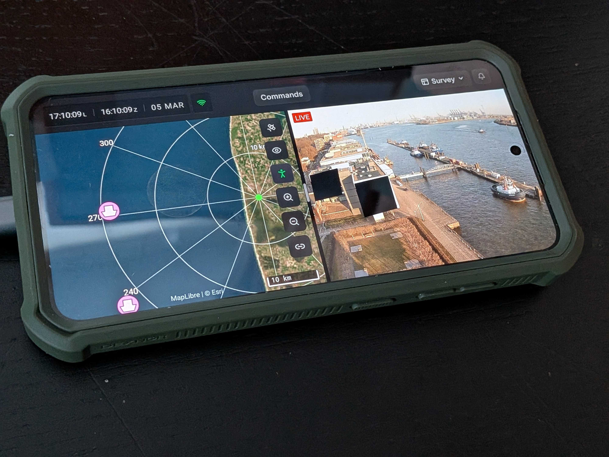

Hydris
======

Like Home Assistant, but for the outdoors. An open-source coordination engine for sensors, assets, and mission systems across large-area networks where things aren't conveniently plugged into a wall.

Integrate once. Deploy everywhere. No vendor lock-in.

Please see [projectqai.github.io](https://projectqai.github.io/) for documentation
